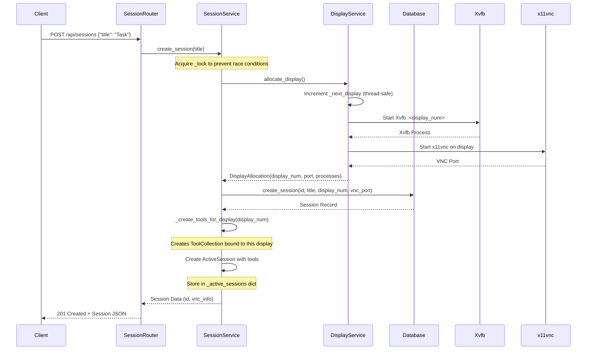
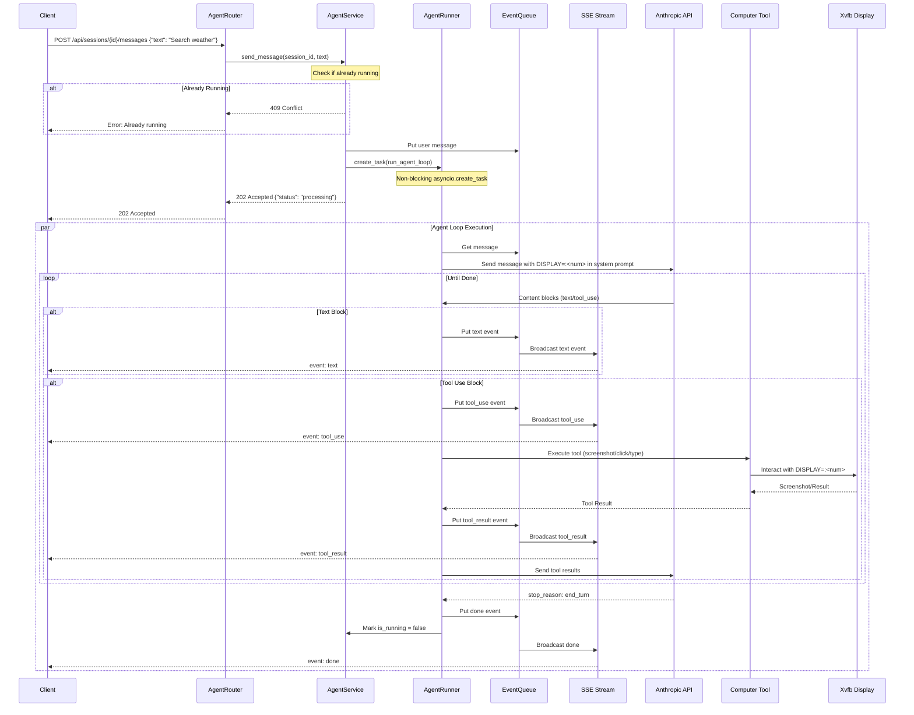
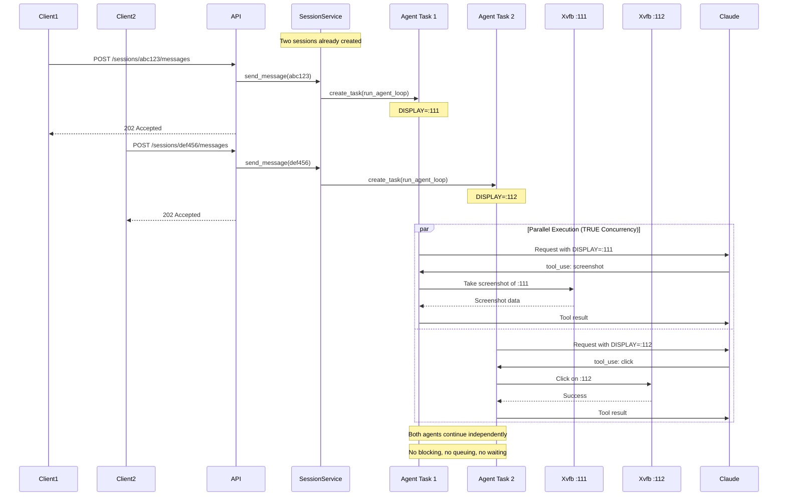
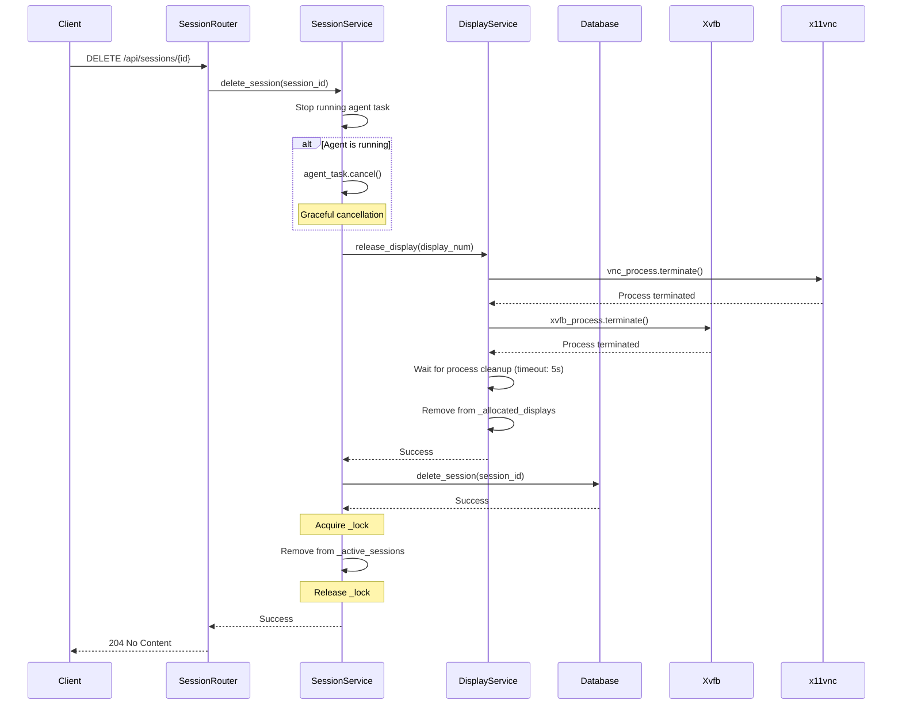
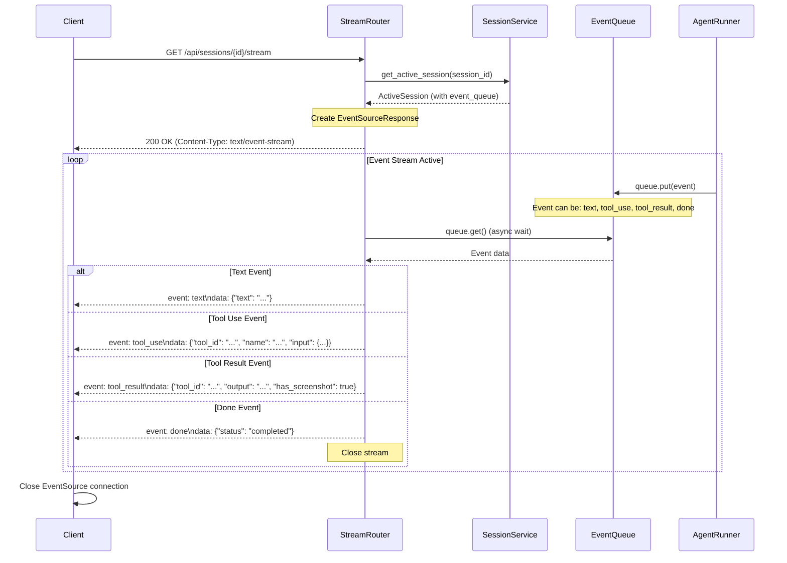
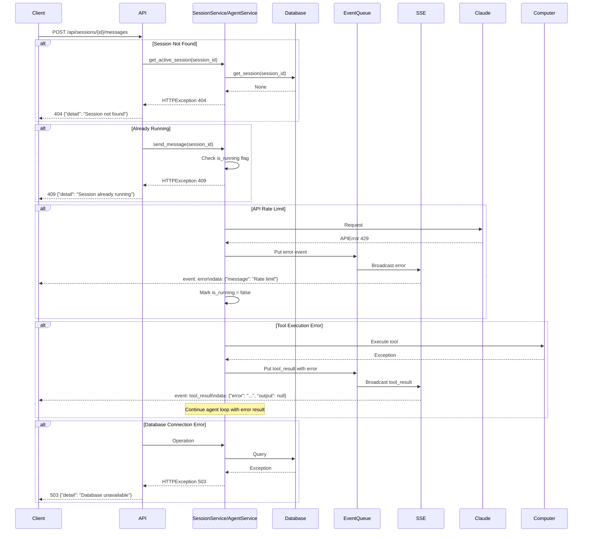

# Computer Use Agent - Sequence Diagrams

**Author: Muhammed Refaat**

---

## 📖 How to Read These Diagrams

This document uses **sequence diagrams** to show how different parts of the system communicate with each other over time.

### Diagram Basics

```
┌─────────┐                ┌─────────┐
│ Client  │                │  Server │
└────┬────┘                └────┬────┘
     │                          │
     │  Request Message    ──→  │
     │                          │
     │  ←──   Response          │
     │                          │
```

**Reading Tips:**
- **Vertical boxes** = Different components/services
- **Arrows (→)** = Messages sent between components
- **Solid arrows (→)** = Requests or actions
- **Dashed arrows (--→)** = Responses or results
- **Time flows downward** = Events at the top happen before events at the bottom
- **Notes** = Additional context about what's happening

---

## 📚 Glossary

| Term | What It Means |
|------|---------------|
| **Session** | An isolated workspace where the AI agent can perform tasks (like opening a separate browser window) |
| **Display** | A virtual screen (like :111, :112) where the agent can see and interact with programs |
| **Xvfb** | Virtual display software - creates a "fake screen" that programs can use |
| **VNC** | Remote desktop technology - lets you view the virtual screen through a web browser |
| **SSE** | Server-Sent Events - live updates from server to browser (like a Twitter feed) |
| **Tool** | An action the agent can perform (screenshot, click, type, etc.) |
| **Agent Loop** | The cycle where the AI thinks → takes action → observes result → thinks again |
| **asyncio.Task** | A background job that runs independently without blocking other work |
| **Queue** | A line where events wait to be processed (like a queue at a coffee shop) |

---

## Table of Contents

1. [Session Creation Flow](#session-creation-flow)
2. [Send Message Flow](#send-message-flow)
3. [Concurrent Sessions Flow](#concurrent-sessions-flow)
4. [Session Deletion Flow](#session-deletion-flow)
5. [SSE Event Stream Flow](#sse-event-stream-flow)
6. [Error Handling Flow](#error-handling-flow)

---

## Session Creation Flow

### 🎯 What Is This?

This diagram shows what happens when you click "Create New Session" - how the system sets up an isolated virtual workspace where an AI agent can operate.

**Real-world analogy:** Like renting a private computer lab room - you get your own screen, keyboard, mouse, and nobody else can interfere with your work.

### 📋 Prerequisites

- API server is running
- Database is initialized
- Xvfb and VNC software are installed

### 🔄 The Process



### 📝 Step-by-Step Walkthrough

1. **Client Request** (Line 1)
   - You send: `POST /api/sessions` with optional title
   - Example: `{"title": "Weather Search Task"}`

2. **Safety Lock** (Line 2)
   - System acquires a lock to prevent two sessions from getting the same display number
   - Like a "DO NOT DISTURB" sign on a door

3. **Display Allocation** (Lines 3-7)
   - System picks next available display number (e.g., :111)
   - Starts Xvfb (virtual screen) on that display
   - Starts VNC server so you can view it remotely
   - Gets back: display number, VNC port, process handles

4. **Database Record** (Line 8)
   - Saves session info to database
   - Stores: session ID, title, display number, VNC port, timestamps

5. **Tool Setup** (Lines 9-10)
   - Creates tools (computer control, bash, text editor) bound to this specific display
   - Tools will only operate on THIS display, not others

6. **Memory Storage** (Line 11)
   - Stores active session in memory for fast access
   - Includes: messages, event queue, tools, agent task

7. **Success Response** (Line 12)
   - Returns session data to you
   - Includes VNC URL so you can watch the agent work

### ✅ Outcome

You receive a **unique session ID** and **VNC connection info**:

```json
{
  "id": "abc123def456",
  "title": "Weather Search Task",
  "vnc_info": {
    "display_num": 111,
    "vnc_port": 5911,
    "novnc_url": "/vnc/?port=5911&autoconnect=true"
  }
}
```

**You can now:**
- Send messages to this session
- Watch the agent work through the VNC viewer
- Keep this session isolated from other sessions

### 🔑 Key Points
- Display allocation uses auto-incrementing counter (no hardcoded limit)
- Each session gets isolated Xvfb + VNC processes
- Lock ensures thread-safe session creation
- Tools are bound to specific display via environment variables

---

## Send Message Flow

### 🎯 What Is This?

This diagram shows what happens when you send a message like "Search the weather in Dubai" to the AI agent - how it thinks, uses tools, and completes the task.

**Real-world analogy:** Like giving instructions to an assistant who then uses a computer to complete the task while you watch their screen and see their progress updates in real-time.

### 📋 Prerequisites

- Session already created (from previous flow)
- Session is not currently processing another message
- Agent has tools available (screenshot, click, type, etc.)

### 🔄 The Process



### 📝 Step-by-Step Walkthrough

#### Phase 1: Message Submission (Instant)

1. **You Send Message** (Line 1)
   - Request: `POST /api/sessions/{id}/messages`
   - Body: `{"text": "Search the weather in Dubai"}`

2. **Safety Check** (Line 2)
   - System checks: "Is this session already running?"
   - If yes → Returns `409 Conflict` error
   - If no → Continues to next step

3. **Queue Message** (Line 3)
   - Your message added to the session's event queue
   - Queue is like a to-do list for the agent

4. **Start Background Task** (Line 4)
   - System launches agent in background (non-blocking)
   - You get immediate response: `202 Accepted`
   - **You don't wait** - the response comes back instantly

#### Phase 2: Agent Thinking & Acting (Background)

5. **Agent Reads Message** (Line 5)
   - Agent pulls your message from the queue
   - Sends it to Claude AI with system instructions

6. **AI Response Loop** (Lines 6-14)

   **When AI Sends Text:**
   - Agent receives: "I'll search for the weather in Dubai"
   - Broadcasts to you via SSE: `event: text`
   - You see this in real-time in your browser

   **When AI Uses a Tool:**
   - AI decides: "I need to take a screenshot first"
   - Broadcasts: `event: tool_use` (you see what tool it's about to use)
   - Agent executes tool on the virtual display
   - Tool returns result (e.g., screenshot image)
   - Broadcasts: `event: tool_result` (you see the outcome)
   - Sends result back to AI for next decision

7. **Loop Continues**
   - AI might use multiple tools: screenshot → click → type → screenshot
   - Each action broadcasts events in real-time
   - You watch the agent work step-by-step

8. **Task Complete** (Line 15)
   - AI sends: `stop_reason: end_turn` (task done)
   - Agent broadcasts: `event: done`
   - Session marked as idle (ready for next message)

### ✅ Outcome

**You receive real-time updates:**

```
event: text
data: {"text": "I'll search for the weather in Dubai."}

event: tool_use
data: {"name": "computer", "input": {"action": "screenshot"}}

event: tool_result
data: {"output": "Screenshot captured", "has_screenshot": true}

event: tool_use
data: {"name": "computer", "input": {"action": "type", "text": "weather Dubai"}}

event: tool_result
data: {"output": "Typed successfully"}

event: done
data: {"status": "completed"}
```

**The agent completes your task** and you watched every step live!

### 🔑 Key Points
- Message sending returns immediately (202 Accepted)
- Agent runs in background asyncio task
- Each tool execution updates SSE stream in real-time
- System prompt dynamically injects correct DISPLAY number
- True async execution allows multiple sessions to run concurrently

---

## Concurrent Sessions Flow

### 🎯 What Is This?

This diagram proves that the system can run **multiple AI agents at the same time** without them interfering with each other - TRUE parallelism.

**Real-world analogy:** Like having two assistants working on different computers in separate rooms at the same time - neither has to wait for the other to finish.

### 📋 Prerequisites

- Two (or more) sessions already created
- Each session has its own virtual display (:111, :112, etc.)
- Each session idle and ready to receive messages

### 🔄 The Process



### 📝 Step-by-Step Walkthrough

#### Scenario: Two Users, Two Tasks, Same Time

**User 1 wants:** "Search weather in Dubai"
**User 2 wants:** "Open calculator and compute 123 * 456"

1. **Both Send Messages Simultaneously** (Lines 1-6)
   - Client 1 → `POST /sessions/abc123/messages` → `202 Accepted`
   - Client 2 → `POST /sessions/def456/messages` → `202 Accepted`
   - Both get immediate responses (under 50ms)

2. **Two Agent Tasks Start** (Lines 7-8)
   - Agent Task 1 starts working on DISPLAY=:111
   - Agent Task 2 starts working on DISPLAY=:112
   - **Both run at the exact same time** (not taking turns)

3. **Parallel Execution** (Lines 9-18)

   **What Agent 1 Does:**
   - Talks to Claude AI: "I need to search weather"
   - Claude responds: "Take a screenshot first"
   - Takes screenshot of display :111
   - Sends screenshot back to Claude
   - *Continues with more steps...*

   **What Agent 2 Does (at the same time):**
   - Talks to Claude AI: "I need to open calculator"
   - Claude responds: "Click on the applications menu"
   - Clicks on display :112
   - Sends result back to Claude
   - *Continues with more steps...*

4. **No Waiting, No Blocking**
   - Agent 1 doesn't wait for Agent 2
   - Agent 2 doesn't wait for Agent 1
   - They use separate displays (:111 vs :112)
   - They have separate tool collections
   - They send separate API requests to Claude

### ✅ Outcome

**Both tasks complete independently:**

```
Session abc123: ✓ Weather search completed in 15 seconds
Session def456: ✓ Calculator math completed in 8 seconds
```

**Key observations:**
- Task 2 finished first (8s) even though Task 1 is still running
- No queueing - both started immediately
- Total system time: 15 seconds (not 15 + 8 = 23 seconds)
- **This is TRUE parallelism**

### 🔑 Key Points
- Each session has its own asyncio.Task
- Tasks run in parallel (not sequentially)
- Each task bound to its own display via env vars
- No shared state between agent loops
- Lock-free execution after session creation

---

## Session Deletion Flow

### 🎯 What Is This?

This diagram shows what happens when you delete a session - how the system gracefully shuts down all resources (processes, database records, memory) without leaving anything behind.

**Real-world analogy:** Like closing down your private computer lab room - turn off the computer, disconnect the monitor, clean up the desk, and return the key.

### 📋 Prerequisites

- Session exists in the system
- You have the session ID

### 🔄 The Process



### 📝 Step-by-Step Walkthrough

1. **Delete Request** (Line 1)
   - You send: `DELETE /api/sessions/{id}`
   - System begins cleanup process

2. **Stop Running Agent** (Lines 2-3)
   - Check: "Is the agent currently working?"
   - If yes → Send cancellation signal to the agent task
   - Agent stops gracefully (finishes current operation, then stops)

3. **Terminate Display Processes** (Lines 4-7)
   - Stop VNC server (remote desktop)
   - Stop Xvfb (virtual screen)
   - Wait up to 5 seconds for clean shutdown
   - If processes don't stop → Force kill them

4. **Clean Display Registry** (Line 8)
   - Remove display number from "allocated displays" list
   - Display :111 is now available for future sessions

5. **Delete Database Record** (Lines 9-10)
   - Delete session from database
   - Removes: session info, all messages, timestamps

6. **Remove from Memory** (Lines 11-13)
   - Acquire lock (safety)
   - Remove session from active sessions dictionary
   - Release lock

7. **Success Response** (Line 14)
   - Returns: `204 No Content` (success, no body needed)

### ✅ Outcome

**All resources cleaned up:**

```
✓ Agent task cancelled
✓ VNC process terminated (port 5911 released)
✓ Xvfb process terminated (display :111 released)
✓ Database record deleted
✓ Memory freed
✓ Display number :111 available for reuse
```

**Session is completely gone** - no trace left in the system.

### 🔑 Key Points
- Graceful task cancellation before cleanup
- Processes terminated with timeout protection
- Database cleaned after process cleanup
- Thread-safe removal from active sessions dict

---

## SSE Event Stream Flow

### 🎯 What Is This?

This diagram shows how you receive **live updates** from the agent as it works - like watching a live sports game instead of reading about it later.

**Real-world analogy:** Like a news ticker or live tweet feed - new information appears automatically without you having to refresh the page.

### 📋 Prerequisites

- Session exists and has started processing a message
- Your browser/client supports EventSource (all modern browsers do)

### 🔄 The Process



### 📝 Step-by-Step Walkthrough

#### Connection Setup

1. **Open Stream Connection** (Line 1)
   - You send: `GET /api/sessions/{id}/stream`
   - Browser opens long-lived HTTP connection

2. **Get Event Queue** (Lines 2-3)
   - Server fetches the session's event queue
   - This queue holds all events from the agent

3. **Stream Ready** (Line 4)
   - Server responds: `200 OK` with `Content-Type: text/event-stream`
   - Connection stays open (doesn't close like normal HTTP)

#### Live Event Broadcasting

4. **Agent Generates Events** (Line 5)
   - Agent working in background puts events in queue
   - Events include: text, tool_use, tool_result, done

5. **Server Waits for Events** (Line 6)
   - Server does: `queue.get()` - waits for next event
   - This is **async** - doesn't block other requests

6. **Event Arrives** (Line 7)
   - Event pops out of queue
   - Server processes it

7. **Broadcast to Client** (Lines 8-15)
   - Server sends event immediately to your browser
   - Format: `event: <type>\ndata: <json>`

**Example event types:**

```
event: text
data: {"text": "I'll help you with that."}

event: tool_use
data: {"name": "computer", "input": {"action": "screenshot"}}

event: tool_result
data: {"output": "Success", "has_screenshot": true}

event: done
data: {"status": "completed"}
```

8. **Loop Continues**
   - Steps 5-7 repeat for every event
   - Stream stays open until `done` or `error` event

9. **Stream Closes** (Line 16)
   - After `done` event, server closes connection
   - Client closes EventSource

### ✅ Outcome

**You see real-time progress:**

```javascript
// In your browser JavaScript
const eventSource = new EventSource('/api/sessions/abc123/stream');

eventSource.addEventListener('text', (e) => {
  const data = JSON.parse(e.data);
  console.log('Agent said:', data.text);
  // Display in UI immediately
});

eventSource.addEventListener('tool_use', (e) => {
  const data = JSON.parse(e.data);
  console.log('Agent using tool:', data.name);
  // Show "Agent is taking screenshot..." in UI
});

eventSource.addEventListener('done', () => {
  console.log('Task complete!');
  eventSource.close();
});
```

**Benefits:**
- Zero polling (no need to ask "are you done yet?" repeatedly)
- Instant updates (< 100ms latency)
- Efficient (connection stays open, minimal overhead)
- Multiple clients can watch the same session

### 🔑 Key Points
- Long-lived HTTP connection with chunked encoding
- asyncio.Queue provides backpressure handling
- Events broadcast immediately as they occur
- Stream closes on done/error event
- Multiple clients can connect to same session stream

---

## Error Handling Flow

### 🎯 What Is This?

This diagram shows how the system handles different types of errors gracefully - ensuring you get clear error messages and the system stays stable.

**Real-world analogy:** Like a professional customer service system - when something goes wrong, you get a clear explanation of what happened and what you can do about it.

### 📋 Prerequisites

- System is running
- Various error conditions may occur during operation

### 🔄 Common Error Scenarios



### 📝 Error Scenarios Explained

#### 1. Session Not Found (404)

**What happened:**
- You tried to send a message to session `xyz789`
- Session doesn't exist (was deleted or never created)

**System response:**
```json
HTTP 404 Not Found
{"detail": "Session not found"}
```

**What to do:**
- Check your session ID
- Create a new session if needed
- Verify session wasn't deleted

---

#### 2. Already Running (409 Conflict)

**What happened:**
- Session `abc123` is currently processing a task
- You tried to send a second message before first one finished

**System response:**
```json
HTTP 409 Conflict
{"detail": "Session already running"}
```

**What to do:**
- Wait for current task to complete (watch SSE stream for `done` event)
- Then send your next message
- Or use a different session for concurrent tasks

---

#### 3. API Rate Limit (429)

**What happened:**
- Too many requests to Anthropic API
- Claude's rate limit exceeded

**System response:**
```
event: error
data: {"message": "API rate limit exceeded - retrying in 5s"}
```

**What system does:**
- Automatically retries with exponential backoff
- Waits 5s, then 10s, then 20s between retries
- Eventually succeeds or gives up after 3 attempts

**What to do:**
- Wait - system handles this automatically
- Consider upgrading your Anthropic API tier for higher limits

---

#### 4. Tool Execution Error

**What happened:**
- Agent tried to click but element not found
- Or screenshot failed
- Or bash command returned error

**System response:**
```
event: tool_result
data: {
  "tool_id": "toolu_123",
  "error": "Element not found on screen",
  "output": null
}
```

**What system does:**
- Sends error back to Claude AI
- Claude adjusts strategy (e.g., "Let me take a screenshot first")
- Task continues with new approach

**What to do:**
- Nothing - agent handles this automatically
- Watch SSE stream to see how agent recovers

---

#### 5. Database Connection Error (503)

**What happened:**
- Database crashed or not responding
- Connection pool exhausted

**System response:**
```json
HTTP 503 Service Unavailable
{"detail": "Database unavailable"}
```

**What to do:**
- Wait a few seconds and retry
- Check database health: `GET /health`
- Contact system administrator if persists

### ✅ Outcome

**Error handling ensures:**

| Situation | Result |
|-----------|--------|
| User mistake (wrong session ID) | Clear `404` error message |
| Timing issue (double send) | `409` prevents corruption |
| External service issue (Claude rate limit) | Automatic retry with backoff |
| Tool failure | Agent adjusts strategy |
| System failure (database down) | `503` with health check info |

**All errors are:**
- ✓ Logged with context
- ✓ Returned with clear messages
- ✓ Non-catastrophic (system stays stable)
- ✓ Recoverable when possible

### 🔑 Key Points
- 404 for missing resources
- 409 for concurrent execution attempts
- 429 propagated from Anthropic API (with retry logic)
- Tool errors sent to Claude as error results
- Database errors return 503 Service Unavailable
- All errors logged with session context

---

## 🏗️ Architecture Deep Dive

This section explains the underlying architecture that makes everything work.

---

### Concurrency Model: How Multiple Sessions Run in Parallel

**The Problem:**
How do we run multiple AI agents at the same time without them blocking each other?

**The Solution:**
Each agent runs in its own asyncio task (like a lightweight thread).

```
┌──────────────────────────────────────────────────────────┐
│                    FastAPI Server                         │
│                  (async event loop)                       │
│                 Python's asyncio engine                   │
├──────────────────────────────────────────────────────────┤
│                                                            │
│  ┌──────────┐    ┌──────────┐    ┌──────────┐           │
│  │ Agent    │    │ Agent    │    │ Agent    │           │
│  │ Task 1   │    │ Task 2   │    │ Task 3   │  ...      │
│  │          │    │          │    │          │           │
│  │ DISPLAY  │    │ DISPLAY  │    │ DISPLAY  │           │
│  │  :111    │    │  :112    │    │  :113    │           │
│  │          │    │          │    │          │           │
│  │ User:    │    │ User:    │    │ User:    │           │
│  │ "Weather"│    │ "Calc"   │    │ "Email"  │           │
│  └────┬─────┘    └────┬─────┘    └────┬─────┘           │
│       │               │               │                   │
│       ├───────────────┼───────────────┤                   │
│       │      TRUE PARALLELISM         │                   │
│       │    asyncio.create_task()      │                   │
│       │      No Waiting, No Queue     │                   │
│       └───────────────┴───────────────┘                   │
│                                                            │
└──────────────────────────────────────────────────────────┘
```

**How it works:**

1. **Request comes in** → `send_message("Search weather")`
2. **Task created** → `asyncio.create_task(run_agent_loop)`
3. **Returns immediately** → `202 Accepted`
4. **Task runs in background** → Doesn't block other requests

**Why this is powerful:**
- Task 1 can be waiting for Claude API response
- While Task 2 is executing a screenshot
- While Task 3 is typing text
- **All at the same time** on a single CPU core (async I/O)

---

### Display Isolation: How Sessions Don't Interfere

**The Problem:**
If two agents click at coordinates (300, 400), how do we ensure they don't click on each other's screens?

**The Solution:**
Each session gets its own virtual display with a unique number.

```
┌─────────────────────────────────────────────────────────┐
│                    Physical Machine                      │
├─────────────────────────────────────────────────────────┤
│                                                           │
│  Session abc123                                          │
│  ├─ DISPLAY=:111                                         │
│  ├─ Xvfb :111 (virtual screen 1920x1080)                │
│  ├─ x11vnc on port 5911                                  │
│  └─ Tools bound to :111                                  │
│                                                           │
│  ─────────────────────────────────────────────────       │
│                                                           │
│  Session def456                                          │
│  ├─ DISPLAY=:112                                         │
│  ├─ Xvfb :112 (virtual screen 1920x1080)                │
│  ├─ x11vnc on port 5912                                  │
│  └─ Tools bound to :112                                  │
│                                                           │
│  ─────────────────────────────────────────────────       │
│                                                           │
│  Session ghi789                                          │
│  ├─ DISPLAY=:113                                         │
│  ├─ Xvfb :113 (virtual screen 1920x1080)                │
│  ├─ x11vnc on port 5913                                  │
│  └─ Tools bound to :113                                  │
│                                                           │
└─────────────────────────────────────────────────────────┘
```

**How it works:**

1. **Session created** → System picks next display number (e.g., 111)
2. **Xvfb started** → Virtual X11 server on that display
3. **VNC attached** → Remote viewing on unique port (5911)
4. **Tools configured** → All tools inject `DISPLAY=:111` in environment

**Why this is powerful:**
- Agent 1 clicks (300, 400) on display :111
- Agent 2 clicks (300, 400) on display :112
- **Completely different screens** - no collision
- Each agent sees only their own applications
- Scale to hundreds of sessions (limited only by RAM)

---

### Event Flow Architecture: How Real-Time Updates Work

**The Problem:**
How do we send live updates from the agent to multiple clients watching?

**The Solution:**
Queue-based event broadcasting with Server-Sent Events (SSE).

```
  Agent Loop                asyncio.Queue              SSE Stream
  (Background)              (Event Buffer)             (Broadcast)

     ┌────┐
     │ AI │                                              Client 1
     └─┬──┘                                              watching
       │                                                  ↓
       ├─ [text]      ──→  queue.put()  ──→  yield  ──→ "I'll help"
       │
       ├─ [tool_use]  ──→  queue.put()  ──→  yield  ──→ "screenshot"
       │
       │                                                  Client 2
       │                                                  connected
       │                                                  ↓
       ├─ [tool_result] ─→  queue.put()  ──→  yield  ──→ "success"
       │
       │                                                  Client 3
       │                                                  joined late
       │                                                  ↓
       ├─ [text]      ──→  queue.put()  ──→  yield  ──→ "Done!"
       │
       └─ [done]      ──→  queue.put()  ──→  yield  ──→ "completed"
                                                ↓
                                          close stream
```

**How it works:**

1. **Agent produces event** → `queue.put({"type": "text", "data": "..."})`
2. **Queue holds event** → FIFO buffer (first in, first out)
3. **SSE endpoint waits** → `async for event in queue: yield event`
4. **Multiple clients receive** → All connected clients get the same event
5. **Backpressure handled** → If client slow, queue buffers (up to memory limit)

**Why this is powerful:**
- **Decoupled** - Agent doesn't know about clients
- **Scalable** - One agent, many watchers
- **Reliable** - Events queued even if no clients connected yet
- **Async** - No blocking on slow clients

---

### Performance Characteristics

#### Latency Measurements

| Operation | Typical Latency | Notes |
|-----------|-----------------|-------|
| Create Session | 300-500ms | Xvfb + VNC startup time |
| Send Message (return) | < 50ms | Immediate 202 response |
| SSE Event Delivery | < 100ms | Queue → Client |
| Tool Execution | 100-500ms | Screenshot, click, type |
| Claude API Call | 1-3 seconds | External API dependency |

#### Scalability Limits

| Resource | Limit | Bottleneck |
|----------|-------|------------|
| Concurrent Sessions | ~100 | RAM (each session ~50-100 MB) |
| Concurrent Agents | Unlimited | Async I/O - no blocking |
| SSE Connections | ~1000 per session | OS file descriptor limit |
| Database Connections | 10 (pooled) | SQLite WAL mode |

#### Resource Usage Per Session

```
Memory: 80 MB
  ├─ Xvfb process: ~50 MB
  ├─ x11vnc process: ~10 MB
  ├─ Python objects: ~10 MB
  └─ Message history: ~10 MB

CPU: < 5% idle, 20-40% active
  ├─ Xvfb rendering: minimal (no display)
  ├─ Tool execution: moderate
  └─ Claude API wait: 0% (I/O bound)

Storage: 100 KB per session
  └─ SQLite database record + messages
```

---

### Architecture Notes

```
┌─────────────────────────────────────────────────────────┐
│                    FastAPI Server                        │
│                  (async event loop)                      │
├─────────────────────────────────────────────────────────┤
│                                                           │
│  ┌──────────┐    ┌──────────┐    ┌──────────┐          │
│  │ Agent    │    │ Agent    │    │ Agent    │          │
│  │ Task 1   │    │ Task 2   │    │ Task 3   │  ...     │
│  │ DISPLAY  │    │ DISPLAY  │    │ DISPLAY  │          │
│  │  :111    │    │  :112    │    │  :113    │          │
│  └────┬─────┘    └────┬─────┘    └────┬─────┘          │
│       │               │               │                  │
│       ├───────────────┼───────────────┤                  │
│       │      TRUE PARALLELISM         │                  │
│       │    (asyncio.create_task)      │                  │
│       └───────────────┴───────────────┘                  │
│                                                           │
└─────────────────────────────────────────────────────────┘
```

### Display Isolation

Each session operates on its own X11 display:

```
Session abc123 → DISPLAY=:111 → Xvfb :111 + x11vnc
Session def456 → DISPLAY=:112 → Xvfb :112 + x11vnc
Session ghi789 → DISPLAY=:113 → Xvfb :113 + x11vnc
```

**Benefits:**
- Complete visual isolation
- No screen coordinate conflicts
- Independent VNC connections
- Scalable to hundreds of sessions

---

**Author:** Muhammed Refaat
**Version:** 2.0.0 - Enhanced for Clarity
**Last Updated:** March 2026

